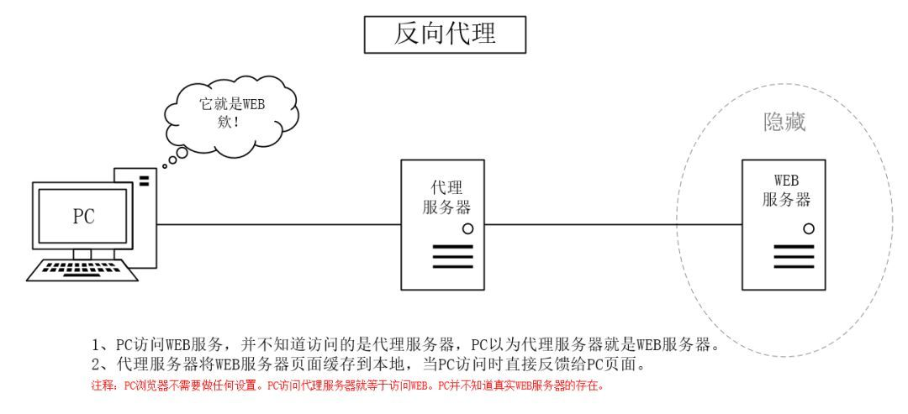

# 网络代理

### 类型
- 正向代理
正向代理是一种客户端的代理技术，帮助客户端访问无法访问的服务资源，可以隐藏用户的真实IP。比如浏览器的代理、VPN等。


当客户端无法访问到服务器（就像使用Google搜索），或者客户端不希望服务端知道自己的真实地址（就像网络爬虫），这时候就需要架设一个代理服务器，客户端访问
网站，请求发送到代理服务器上，由代理服务器根据客户端的请求去访问网站，然后将网站返回的数据发送给客户端。

在这个过程当中，客户端访问的是真实的网站地址，只不过请求并未直接发送到网站，而是由代理服务器去做真实的请求。过程如下：
1) 代理服务器接收客户端的请求，复制原请求对象，并根据数据配置新的请求参数
2) 把新的请求发送到真实服务器，并接收服务器的返回数据
3) 代理服务器做一些响应的处理，并把数据返回给客户端

- 反向代理
反向代理是一种服务端的代理技术，帮助服务端做负载均衡、缓存、提供安全校验等，可以隐藏服务器真实IP。比如LVS技术、nginx proxy_pass、网关等



反向代理服务器是隐藏真实服务器的地址，客户端访问的服务器就是反向代理服务器，其收到请求后，会把请求发送给真实服务器，最后把数据返回给客户端。
看起来好像和正向代理一样，但是区别在于在正向代理中，客户端访问的地址是真实服务器地址，而反向代理中，客户端访问的地址就是代理服务器地址。

1) 代理接收客户端请求，更改请求结构体信息
2) 通过一定的负载均衡算法获取真实服务器地址
3) 把请求发送到真实服务器，并获取返回内容
4) 对返回内容做处理，然后返回给客户端

### [正向代理示例](forward_proxy)
### [反向代理示例](reverse_proxy)
1. [reverse_proxy/simple](reverse_proxy/simple/main.go)

    使用http基础包实现简单的反向代理示例

2. [reverse_proxy/base](reverse_proxy/base/main.go)

    使用ReverseProxy实现简单反向代理示例

3. [reverse_proxy/modify](reverse_proxy/modify/main.go)
  
    使用ReverseProxy实现反向代理，并在出现请求错误时，对返回结果进行修改处理

### ReverseProxy
ReverseProxy是Go语言为我们提供的实现反向代理的结构体，包含在标准库中。
```go
type ReverseProxy struct {
	// 控制器必须是一个函数，函数内部对请求进行修改
	Director func(*http.Request)
	
	// 连接池，如果为nil，则使用http.DefaultTransport
	Transport http.RoundTripper

	// 刷新到客户端的刷新间隔
	FlushInterval time.Duration

	// 错误记录器
	ErrorLog *log.Logger

    // 定义一个缓冲池，在复制http响应时使用，用以提高请求效率
	BufferPool BufferPool

    // 修改response
	ModifyResponse func(*http.Response) error

	// 错误处理回调函数，如果为nil时，则遇到错误会显示502
	ErrorHandler func(http.ResponseWriter, *http.Request, error)
}
```
在我们使用的